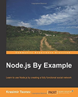

```
Roberto Nogueira  BSd EE, MSd CE
Solution Integrator Experienced - Certified by Ericsson
```

# Nodejs by Example



**About**

`Node.js` is a JavaScript-driven technology, which means that developers can use the same language to write backend code. Its growing community and the large amount of available modules make `Node.js` one of the most attractive development environments.

`Node.js` By Example covers `Node.js` fundamentals and teaches you how to use its technology to architect a project. It shows you how to manage an application's assets and how to implement the Model-View-Controller pattern. The next few chapters demonstrate how to develop the features of your social network. It also empowers you to communicate with a database, including storing, retrieving, and deleting data. The book ends by discussing the most popular ways to test your user interface in an efficient way.

[homepage](https://www.packtpub.com/application-development/nodejs-example)

## Contents

```
[ ] 1: NODE.JS FUNDAMENTALS
[ ] 2: ARCHITECTING THE PROJECT
[ ] 3: MANAGING ASSETS
[ ] 4: DEVELOPING THE MODEL-VIEW-CONTROLLER LAYERS
[ ] 5: MANAGING USERS
[ ] 6: ADDING FRIENDSHIP CAPABILITIES
[ ] 7: POSTING CONTENT
[ ] 8: CREATING PAGES AND EVENTS
[ ] 9: TAGGING, SHARING, AND LIKING
[ ] 10: ADDING REAL-TIME CHAT
[ ] 11: TESTING THE USER INTERFACE
```
